# Voice Agent Call Flow: Twilio → LiveKit → Agent

## Simple Flow Diagram

```mermaid
graph LR
    A[📞 Incoming Call] -->|1| B[Twilio Number]
    B -->|2| C[LiveKit SIP URL]
    C -->|3| D[Dispatch Rule Check]
    D -->|4| E[Create Room]
    E -->|5| F[Start Agent]
    F -->|6| G[🎤 Voice Pipeline Active]
```



## Step-by-Step Flow

### 1. Call Arrives at Twilio
- Someone calls your Twilio phone number
- Twilio receives the call from the phone network

### 2. Twilio Forwards to LiveKit
- Twilio looks at your number configuration
- Finds your LiveKit SIP URL: `sip:incoming@your-project.livekit.cloud`
- Forwards the call via SIP protocol

### 3. LiveKit Receives Call
- LiveKit SIP endpoint receives the incoming call
- Extracts information:
  - **Trunk ID**: Which SIP trunk received this call
  - **Caller Number**: Who is calling
  - **Called Number**: Which number they dialed

### 4. Dispatch Rule Matching

Your dispatch rule:
```
Rule ID: SDR_eXWGKMAqyG4E
Trunk: ST_LDs7RWhP5bpa
Room: call_<caller-number>
Agent: incoming-call-agent
```

LiveKit checks:
- ✅ Is this call from trunk `ST_LDs7RWhP5bpa`? 
- If YES → Use this rule
- If NO → Check next rule (or reject)

### 5. Room Creation
- LiveKit creates a room named: `call_+14155551234` (example)
- The caller joins as a "SIP participant"
- Audio from the phone call is now streaming into this room

### 6. Agent Activation
- LiveKit notifies your agent: "New room created, join now!"
- Your `incoming-call-agent` connects to the room
- Agent can now:
  - Hear the caller (receive audio)
  - Speak to the caller (send audio)

### 7. Voice Pipeline Active
```
Caller speaks → STT → Your Agent Logic → LLM → TTS → Caller hears response
```

## The Key Connection

**Dispatch Rule** = The traffic controller that decides:
- Which calls to accept (trunk matching)
- Where to put them (room name)
- Who handles them (agent name)

**Without a matching dispatch rule**, LiveKit will reject the call!

## Your Current Setup

```
All calls to your Twilio number
    ↓
Go to LiveKit trunk ST_LDs7RWhP5bpa
    ↓
Match your dispatch rule
    ↓
Create room "call_<caller-number>"
    ↓
Start "incoming-call-agent"
```

Every call follows this exact same path because you have one dispatch rule matching one trunk.